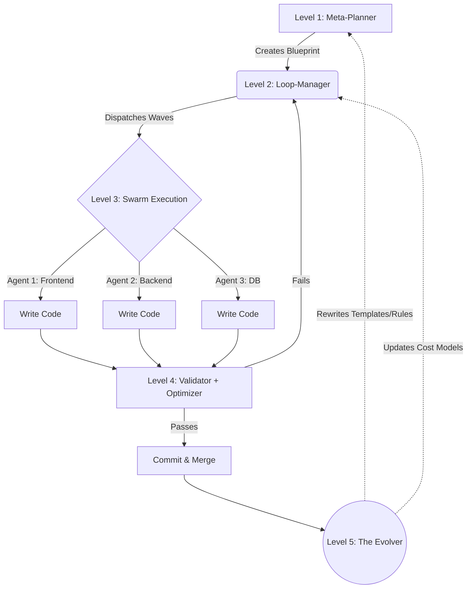

# 🏗️ HELIX Architecture

HELIX abandons the traditional sequential loop model for a **Hierarchical Evolutionary Swarm**. This ensures massive parallelization while maintaining strict architectural coherence and, crucially, allowing the system to learn over time.

## 🗺️ The 5-Level Hierarchy

### 🧠 Level 1: Meta-Planner
The brain of the operation. It receives the initial prompt and synthesizes a master blueprint. It determines the optimal model routing (e.g., routing complex reasoning to `claude-3.7-sonnet` and fast generation to `gemini-2.5-flash`).

### 🚄 Level 2: Loop-Manager
The orchestrator. It breaks the blueprint into discrete, non-blocking tasks and schedules them into **Parallel Waves**. It actively monitors context limits and token costs using the Cost Predictor.

### 🐝 Level 3: Swarm Execution
The doers. These are highly specialized sub-agents (Frontend UI, Database Architecture, API Design, Security Audit) that run concurrently. They operate in isolated environments and only communicate via the Loop-Manager.

### 🛡️ Level 4: Validator + Optimizer
The gatekeeper. Before any code is committed, it runs tests, linters, and architectural checks. If a sub-agent fails, the Validator isolates the error and sends it back to the Loop-Manager for a localized retry, without failing the entire wave.

### 🔥 Level 5: The Evolver
The secret sauce. Runs post-execution. It analyzes the delta between the Meta-Planner's blueprint and the final Validator-approved code. If it notices repetitive corrections (e.g., "always use Tailwind v4"), it reaches into the `.helix/` config directory and permanently rewrites its own templates, style guides, and cost predictors.

## 🌊 Flowchart Description

1. **Input:** User provides a high-level goal.
2. **Planning:** Meta-Planner drafts the `task_plan.md`.
3. **Execution:** Loop-Manager spawns the Swarm. Swarm writes code in parallel.
4. **Validation:** Validator checks code. If error -> Retry loop. If pass -> Merge.
5. **Evolution:** Evolver analyzes the run. Did we waste tokens on a bad prompt? Did we violate a local codebase rule? The Evolver updates `.helix/rules.md` autonomously.
6. **Next Run:** The system is now 1% smarter and faster for this specific repository.
