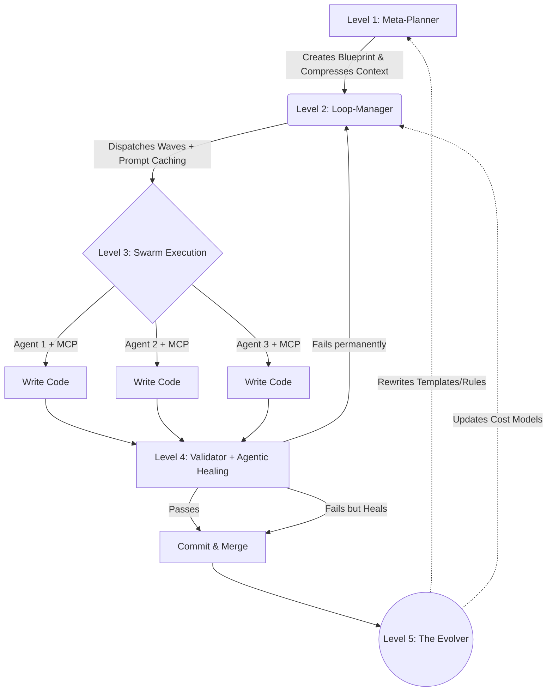

# 🏗️ HELIX Architecture (v2.0)

HELIX v2.0 abandons the traditional sequential loop model for a **Hierarchical Evolutionary Swarm**. This architecture ensures massive parallelization, context safety, and strict architectural coherence.

## 🗺️ The 5-Level Hierarchy

### 🧠 Level 1: Meta-Planner (Context Compression)
The brain of the operation. It receives the initial prompt and synthesizes a master blueprint. To avoid "Context Rot", it uses **Context Compression**, generating lightweight `summarized_state.md` vectors instead of passing massive git histories downstream.

### 🚄 Level 2: Loop-Manager (Prompt Caching)
The orchestrator. It breaks the blueprint into discrete, non-blocking tasks and schedules them into **Parallel Waves**. It actively uses **Provider-level Prompt Caching**, slashing token costs by up to 60% on deep, long-running execution cycles.

### 🐝 Level 3: Swarm Execution (MCP Native)
The doers. These are highly specialized sub-agents running in isolated Git Worktrees. In v2.0, they have **MCP Native Support**, seamlessly binding to external tools (like Postgres, Linear, GitHub) to gather real-world data without hallucinations.

### 🛡️ Level 4: Validator + Agentic Healing
The gatekeeper. Before any code is committed, it runs tests, linters, and architectural checks. If an error is detected, instead of a hard crash, it triggers **Agentic Healing**—spawning a micro-agent to autonomously fix the code before giving up and rolling back.

### 🔥 Level 5: The Evolver
The secret sauce. Runs post-execution. It analyzes the delta between the Meta-Planner's blueprint and the final Validator-approved code. It permanently rewrites its own `.helix/learned_rules.md`, templates, and cost predictors.

HELIX isn't just executing; it's mutating to fit your exact repository.