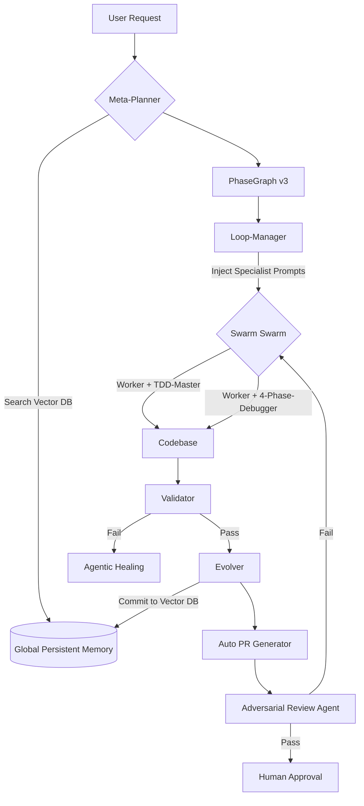

# 🏗️ HELIX Architecture (v3.0) — Ecosystem & Enterprise

v3.0 marks the transition from a local orchestrator to a persistent, multi-platform ecosystem. This update focuses on long-term intelligence, specialized execution, and seamless integration with the broader AI engineering toolchain.

---

## 🧠 1. Persistent Vector DB Memory (Cross-Session)

### 🚀 Goal
Move beyond transient `summarized_state.md` files. HELIX will now maintain a persistent, semantic memory of architectural decisions, bug patterns, and project context across sessions and even across different repositories.

### 🛠️ Technical Design
- **Engine:** Proposed local **SQLite-vss** (for low-dependency portability) or **ChromaDB** (for more advanced semantic features).
- **Storage:** Local user directory (`~/.helix/memory/vectors.db`) rather than per-project `.helix/` only.
- **Syncing:** 
  - **Read:** Level 1 Meta-Planner queries the Vector DB for "similar project context" or "known architectural traps" at the start of every run.
  - **Write:** Level 5 Evolver vectorizes the execution delta and commits it to the global memory.

### 🔮 Data Model
```json
{
  "id": "uuid",
  "project_name": "helix-orchestrator",
  "context_vector": [...],
  "content": "Architectural decision: Use isolated git worktrees for swarm agents to prevent merge conflicts in parallel waves.",
  "source": "v2.1-infrastructure-hooks-logs",
  "timestamp": "2026-03-09T14:00:00Z"
}
```

---

## 🛠️ 2. Embedded Specialized Sub-Skills

### 🚀 Goal
Inject high-level domain expertise directly into the Swarm. Each Tier-2 Worker is no longer just a "general executor" but can be transformed into a specialist.

### 🎭 Specialized Roles
- **TDD-Master:** Enforces Red-Green-Refactor cycles. Refuses to commit code without a corresponding passing test.
- **4-Phase-Debugger:** Activated automatically on Level 4 Validator failure. Follows: (1) Reproduce (2) Isolate (3) Patch (4) Verify.
- **Strict-Code-Reviewer:** An internal adversarial agent that reviews worker outputs before they hit the Validator.

### 🕹️ Dynamic Selection
The Level 2 Loop-Manager will now inject specialist prompts based on the phase type:
- `type: critical-code` → `TDD-Master` + `Strict-Code-Reviewer`
- `status: HEALING` → `4-Phase-Debugger`

---

## 🤖 3. Auto PR Creation + Adversarial Review

### 🚀 Goal
Automate the final "last mile" of the software engineering lifecycle. 

### 🔄 The PR Lifecycle
1. **Wave Finish:** All phases in the PhaseGraph complete.
2. **Evolver Trigger:** After updating rules, the Evolver runs `helix-pr-gen.sh`.
3. **Draft PR:** HELIX creates a GitHub/GitLab/Bitbucket PR with a comprehensive description generated from the execution report.
4. **Adversarial Review:** A dedicated "Chaos Agent" is spawned to review the PR with a hostile, skeptical persona. It looks for edge cases the Swarm might have missed.
5. **Auto-Handoff:** If Adversarial Review passes, HELIX pings the human developer.

---

## 🌍 4. Universal Multi-Platform Support

### 🚀 Goal
Allow HELIX to orchestrate projects outside of the Gemini CLI / Claude Code environment.

### 📦 Export Spec (`helix.spec.json`)
A universal format that can be consumed by other AI-enabled IDEs and CLIs.
- **Adapters:**
  - `cursor-adapter`: Converts GSD phases into Cursor Composer steps.
  - `aider-adapter`: Converts Swarm tasks into Aider command sequences.
  - `codex-adapter`: Bridges into the Codex AI ecosystem.

---

## 📊 v3.0 Execution Graph



HELIX v3.0 • caramaschiHG
